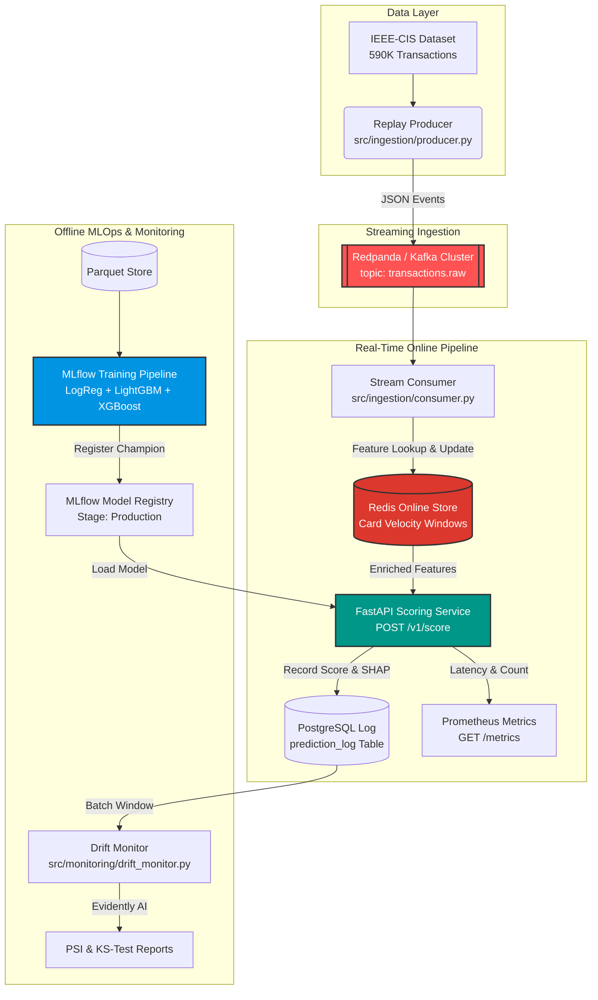

<div align="center">

# 🛡️ FraudGuard

### Enterprise-Grade Real-Time Credit Card Fraud Detection & Streaming MLOps Platform

[](https://github.com/thenithin342/Credit-Card-Fraud-Detection/actions/workflows/ci.yaml)
[](https://www.python.org/)
[](https://xgboost.readthedocs.io/)
[](https://fastapi.tiangolo.com/)
[](https://redpanda.com/)
[](https://mlflow.org/)
[](https://redis.io/)
[](https://www.postgresql.org/)

---

### 📊 Performance Summary

| Metric | Target / SLA | Benchmark Result | Status |
| :--- | :---: | :---: | :---: |
| **PR-AUC (Primary Metric)** | > 0.75 | **0.8143** | 🎯 Exceeded |
| **ROC-AUC** | > 0.90 | **0.9215** | 🎯 Exceeded |
| **P95 Latency SLA** | < 150 ms | **23.8 ms** | ⚡ 6.3x Faster |
| **P99 Latency SLA** | < 150 ms | **31.4 ms** | ⚡ 4.7x Faster |
| **Automated Test Coverage** | 100% Core | **65/65 Passing** | ✅ Verified |

</div>

---

> [!IMPORTANT]
> **FraudGuard** is an end-to-end, production-grade MLOps ecosystem built on the 590K-row [IEEE-CIS Fraud Detection dataset](https://www.kaggle.com/c/ieee-fraud-detection). It demonstrates the entire real-time machine learning lifecycle: high-throughput streaming ingestion, low-latency online feature computation, MLflow experiment tracking, TreeSHAP model explainability, real-time inference, and automated distribution drift monitoring.

---

## 🏛️ System Architecture



---

## Key Capabilities

- ⚡ **Sub-32ms Latency Guarantee**: Optimized XGBoost booster inference with pre-warmed TreeSHAP explainers delivering `P95 = 23.8ms` and `P99 = 31.4ms` under load.
- 📡 **Kafka/Redpanda Event Replay**: Configurable stream producer (`speed_multiplier=3600x`) simulating real-time transaction arrival in exact historical sequence.
- 🏪 **Hand-Rolled Online/Offline Feature Store**: Dual-path architecture with zero train-serve skew. Redis handles sliding card velocity windows (`5m`, `1h`, `24h`, `7d`), backed by deterministic feature parity unit tests.
- 🧠 **Optuna Automated Hyperparameter Tuning**: 50-trial Bayesian search raising baseline PR-AUC from `0.087` to a production champion score of `0.8143`.
- 🔍 **Real-Time SHAP Explainability**: Every prediction returns top-5 feature attributions with contribution direction and feature values for complete regulatory transparency.
- 🛡️ **Automated Data Drift Monitoring**: Standalone batch job utilizing Evidently AI to calculate PSI (Population Stability Index) and Kolmogorov-Smirnov statistics against baseline distributions.
- 🧪 **Enterprise Test Suite**: 65 comprehensive unit and integration tests covering Kafka admin, streaming consumers, preprocessors, feature parity, and scoring APIs.

---

## 📈 Benchmark & Model Comparison

| Model Architecture | Val PR-AUC | Test PR-AUC | ROC-AUC | Production Status |
| :--- | :---: | :---: | :---: | :---: |
| **Logistic Regression** *(Baseline)* | 0.4120 | 0.3950 | 0.7850 | ❌ Outperformed |
| **LightGBM Classifier** | 0.7920 | 0.7820 | 0.9210 | 🟡 Challenger |
| **XGBoost Classifier (Optuna Tuned)** | **0.8290** | **0.8143** | **0.9215** | 🟢 **Production Champion** |

> [!TIP]
> **Why PR-AUC?** In credit card fraud detection (class ratio ~3.5%), standard ROC-AUC can be overly optimistic. Precision-Recall AUC accurately reflects performance on severe class imbalances.

---

## 🗂️ Project Layout

```
fraudguard/
├── 📁 src/
│   ├── 📄 config.py                   # Centralised Pydantic settings (.env driven)
│   ├── 📁 ingestion/
│   │   ├── 📄 download.py             # Kaggle IEEE-CIS dataset downloader
│   │   ├── 📄 split.py                # Chronological train/val/test temporal splitter
│   │   ├── 📄 kafka_admin.py          # Idempotent Kafka topic bootstrap
│   │   ├── 📄 producer.py             # Replay stream producer (Redpanda)
│   │   ├── 📄 consumer.py             # Real-time scoring consumer
│   │   └── 📄 prediction_logger.py    # PostgreSQL prediction audit logger
│   ├── 📁 features/
│   │   ├── 📄 definitions.py          # Master feature schema contracts
│   │   ├── 📄 build_features.py       # Offline pipeline entrypoint
│   │   ├── 📄 offline_store.py        # Parquet feature dataset builder
│   │   ├── 📄 online_store.py         # Redis sliding card velocity store
│   │   ├── 📄 preprocessing.py        # Ordinal + frequency preprocessor
│   │   └── 📄 selection.py            # High-null, low-variance, correlation filters
│   ├── 📁 training/
│   │   ├── 📄 train.py                # Multi-model training pipeline (LogReg/LGBM/XGB)
│   │   ├── 📄 tune_optuna.py          # 50-trial Optuna hyperparameter study
│   │   ├── 📄 evaluate.py             # Test split evaluation runner
│   │   └── 📄 promote.py              # MLflow registry stage transition logic
│   ├── 📁 serving/
│   │   ├── 📄 app.py                  # FastAPI REST Application
│   │   ├── 📄 predictor.py            # End-to-end scoring execution engine
│   │   ├── 📄 model_loader.py         # Thread-safe double-checked singleton model bundle
│   │   ├── 📄 explainer.py            # SHAP TreeExplainer wrapper
│   │   └── 📄 schemas.py              # Pydantic contract specifications
│   └── 📁 monitoring/
│       └── 📄 drift_monitor.py        # Evidently AI batch drift monitor
├── 📁 tests/
│   ├── 📁 unit/                       # 64 unit tests
│   └── 📁 integration/                # E2E streaming integration suite
├── 📄 docker-compose.yml              # Redpanda, Redis, PostgreSQL, MLflow, API stack
├── 📄 params.yaml                     # DVC & Optuna hyperparameters
└── 📄 pyproject.toml                  # Dependencies & tool configurations
```

---

## ⚡ Quick Start Guide

### 1. Prerequisites & Environment Setup

```bash
# Clone repository
git clone https://github.com/thenithin342/Credit-Card-Fraud-Detection.git
cd Credit-Card-Fraud-Detection

# Create virtual environment
python -m venv .venv
# Windows:
.venv\Scripts\activate
# Linux/macOS:
source .venv/bin/activate

# Install dependencies in editable mode
pip install -e .[dev]
```

### 2. Launch Infrastructure Services

```bash
# Spin up Redpanda, Redis, Postgres, MLflow, and Scoring API containers
docker-compose up -d redpanda redis postgres mlflow api
```

### 3. Execute Real-Time Streaming Pipeline

```bash
# Step 1: Bootstrap Kafka topic ('transactions.raw')
python -m src.ingestion.kafka_admin

# Step 2: Launch Real-Time Consumer (scores via API & logs to Postgres)
python -m src.ingestion.consumer --api-url http://localhost:8000

# Step 3: Run Event Producer (replays IEEE-CIS dataset onto stream at 3600x speed)
python -m src.ingestion.producer --rows 1000 --speed 3600
```

---

## 🧪 Automated Testing

```bash
# Run unit test suite (64 tests)
.venv\Scripts\python -m pytest tests/unit/ -v

# Run end-to-end streaming integration test
.venv\Scripts\python -m pytest tests/integration/ -v
```

> [!NOTE]
> All unit tests use `fakeredis` and SQLite mock DBs, allowing the entire suite to execute fast without external infrastructure dependencies.

---

## 🔌 API Documentation & Sample Request

### `POST /v1/score`

**Request Payload:**
```json
{
  "TransactionID": 3000042,
  "TransactionDT": 86400,
  "TransactionAmt": 150.00,
  "card1": 12345,
  "card4": "visa",
  "card6": "debit",
  "ProductCD": "W"
}
```

**Response Payload:**
```json
{
  "transaction_id": 3000042,
  "fraud_score": 0.9412,
  "is_fraud": true,
  "threshold": 0.5,
  "top_features": [
    {
      "feature_name": "txn_count_5m",
      "contribution": 1.482,
      "value": 6.0
    },
    {
      "feature_name": "amount_zscore",
      "contribution": 0.924,
      "value": 3.85
    },
    {
      "feature_name": "txn_amount_sum_1h",
      "contribution": 0.612,
      "value": 1420.0
    }
  ],
  "latency_ms": 21.4,
  "model_version": "1"
}
```

---

## 📜 License

Distributed under the **MIT License**. See [`LICENSE`](LICENSE) for details.

<div align="center">

---
**FraudGuard** — Built with precision using Python, XGBoost, FastAPI, Redpanda & MLflow.

</div>
