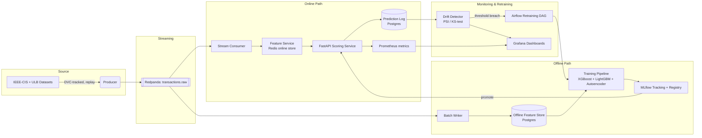

# System Architecture — FraudGuard

## 1. High-Level Diagram



## 2. Component Responsibilities

**Data Pipeline (`src/ingestion/`)**  
Downloads IEEE-CIS and ULB datasets via Kaggle API (DVC-tracked). Provides a
`split.py` module for chronological train/val/test splitting preserving class ratios.
The producer replays rows in timestamp order onto Redpanda at a configurable speed.

**Feature Service (`src/features/`)**  
The hand-built feature store. Maintains:
- **Online store (Redis)**: low-latency point lookups keyed by synthetic `card_id`,
  storing rolling aggregates (transaction count/amount over trailing windows).
- **Offline store (Postgres)**: append-only historical feature log used for training,
  so training and serving read from a schema-consistent source of truth.

**Critical property**: the exact same feature definitions compute the same values
whether called from training or from serving — verified by an automated parity test.

**Training Pipeline (`src/training/`)**  
Pulls from the offline store, trains Logistic Regression (baseline), XGBoost/LightGBM
(primary), and an Isolation Forest / small autoencoder (unsupervised signal). Logs
every run to MLflow (params, metrics, PR curve, feature importance). Registers the
best model to the MLflow Model Registry.

**Scoring Service (`src/serving/`)**  
FastAPI service: per incoming transaction, fetches online features → loads the current
production model from MLflow registry → returns score + decision + latency. Instrumented
with Prometheus counters/histograms.

**Drift Detector (`src/monitoring/`)**  
Scheduled batch job comparing live feature/prediction distributions against the
training-time baseline using PSI and KS-test. Crossing a threshold emits a
Grafana-visible metric + alert and can trigger retraining.

**Orchestration (`src/orchestration/`)**  
Airflow DAGs for: (a) scheduled retraining, (b) drift-triggered retraining, and
(c) human-approval gate before a newly trained model is promoted to production.

## 3. Data Flow Narrative

1. Datasets are DVC-tracked; `dvc repro` runs ingest → validate → split.
2. The producer replays IEEE-CIS transactions onto `transactions.raw`.
3. A stream consumer reads each message, calls the Feature Service to fetch/update
   online features, and forwards the enriched record to the Scoring Service.
4. The Scoring Service returns a fraud score; logged to Postgres and Prometheus.
5. A batch writer persists raw + computed features to the offline store for training.
6. The Drift Detector continuously compares live distributions to the training baseline.
7. A threshold breach fires a retraining trigger and a dashboard alert.
8. A human reviews the candidate model in MLflow before promoting to production.

## 4. Failure Modes & Rollback

- **Model regression after promotion**: MLflow retains all prior versions; rollback is
  a registry stage transition, not a redeploy from scratch.
- **Feature Service unavailable**: Scoring Service fails closed with an explicit
  "degraded" flag — never fail silently.
- **Drift false-positive storm**: threshold and cooldown period are configurable;
  retraining can't be triggered more often than a defined minimum interval.

## 5. Repository Structure

```
Credit Card Fraud Detection/
├── docs/                     ← you are here
│   ├── PRD.md
│   ├── ARCHITECTURE.md
│   ├── TECH_STACK.md
│   ├── ROADMAP.md
│   ├── DATA_SPEC.md
│   └── DECISIONS.md
├── src/
│   ├── ingestion/            ← download.py, split.py, producer.py, consumer.py
│   ├── features/             ← definitions.py, online_store.py, offline_store.py
│   ├── training/             ← train.py, evaluate.py
│   ├── serving/              ← main.py (FastAPI), schemas.py
│   ├── monitoring/           ← drift.py, metrics.py
│   ├── orchestration/        ← retrain_dag.py
│   └── validation/           ← ge_suite.py (Great Expectations)
├── tests/
│   ├── unit/                 ← test_split.py, test_features.py, ...
│   └── data_validation/      ← test_schema.py
├── infra/
│   ├── docker/               ← api.Dockerfile, mlflow.Dockerfile
│   └── k8s/                  ← Phase 8 stretch goal
├── data/
│   ├── raw/                  ← DVC-tracked (gitignored)
│   └── processed/            ← DVC-tracked parquets (gitignored)
├── reports/validation/       ← GE validation reports
├── notebooks/                ← exploration only
├── .github/workflows/        ← CI pipeline
├── dvc.yaml                  ← ingest → validate → split pipeline
├── params.yaml               ← all experiment parameters
├── pyproject.toml            ← ruff, black, mypy, pytest config
├── docker-compose.yml        ← Redpanda, Redis, Postgres, MLflow
└── requirements.txt
```
