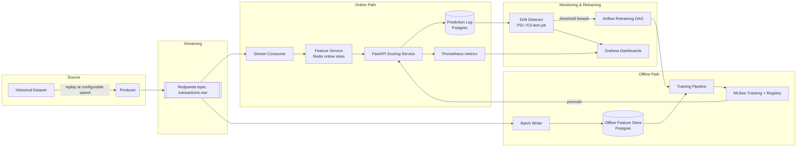

# System Architecture

## 1. High-Level Diagram



## 2. Component Responsibilities

**Producer (`src/ingestion`)**
Reads the historical dataset in timestamp order and publishes each transaction as a
JSON message to a Redpanda topic, at a configurable replay speed (1x = real elapsed
time, Nx = accelerated for demo purposes).

**Feature Service (`src/features`)**
The hand-built feature store. Maintains:
- **Online store (Redis)**: low-latency point lookups keyed by synthetic `card_id`,
  storing rolling aggregates (e.g. transaction count/amount over trailing windows).
- **Offline store (Postgres)**: append-only historical feature log used for training,
  so training and serving read from a schema-consistent source of truth.
The critical property this component proves: **the exact same feature definitions
compute the same values whether called from training or from serving.**

**Training Pipeline (`src/training`)**
Pulls from the offline store, trains baseline + primary models, logs every run
(params, metrics, artifacts, PR curve) to MLflow, and registers candidate models.
Promotion from "staging" to "production" in the MLflow registry is a deliberate,
logged step — not automatic — until Phase 6's retraining loop is proven safe.

**Scoring Service (`src/serving`)**
FastAPI service that, per incoming transaction: fetches online features → loads the
current production model from the MLflow registry → returns a score + decision +
latency metric. Instrumented with Prometheus counters/histograms.

**Drift Detector (`src/monitoring`)**
A scheduled batch job that compares a recent window of live feature/prediction
distributions against the training-time baseline using Population Stability Index
(PSI) and the Kolmogorov–Smirnov test. Crossing a defined threshold emits an event
that can trigger retraining and always emits a Grafana-visible metric + alert.

**Orchestration (`src/orchestration`)**
Airflow DAGs for: (a) scheduled retraining, (b) drift-triggered retraining, and
(c) the human-approval gate before a newly trained model is promoted to production.

## 3. Data Flow Narrative

1. The producer replays the dataset onto `transactions.raw`.
2. A stream consumer reads each message, calls the Feature Service to fetch/update
   online features, and forwards the enriched record to the Scoring Service.
3. The Scoring Service returns a fraud score; the transaction + score + latency are
   logged to Postgres and to Prometheus.
4. In parallel, a batch writer persists raw + computed features to the offline store
   for future training runs.
5. On a schedule (or on drift trigger), the training pipeline reads the offline
   store, trains a candidate model, and logs it to MLflow.
6. The Drift Detector continuously compares live distributions to the training
   baseline; a threshold breach fires a retraining trigger and a dashboard alert.
7. A human reviews the candidate model's metrics in MLflow before promoting it to
   production — this gate is a resume talking point (safe rollout discipline).

## 4. Failure Modes & Rollback

- **Model regression after promotion**: MLflow registry retains all prior versions;
  rollback is a registry stage transition, not a redeploy from scratch.
- **Feature Service unavailable**: Scoring Service should fail closed to a
  conservative default score with an explicit "degraded" flag in the response and a
  fired alert — never fail silently.
- **Drift false-positive storm**: threshold and cooldown period are configurable so
  retraining can't be triggered more often than a defined minimum interval.

## 5. Repository Structure

```
fraud-detection-mlops/
├── CLAUDE.md                  # instructions for Claude Code — read this first
├── README.md                  # human-facing entry point
├── docs/
│   ├── PRD.md
│   ├── TECH_STACK.md
│   ├── ARCHITECTURE.md        # this file
│   ├── ROADMAP.md
│   ├── DATA_SPEC.md
│   └── DECISIONS.md           # running architecture decision log
├── data/
│   ├── raw/                   # downloaded dataset lands here (gitignored)
│   └── processed/             # engineered features (gitignored, DVC-tracked)
├── src/
│   ├── ingestion/              # producer + stream consumer
│   ├── features/                # online/offline feature store logic
│   ├── training/                # training scripts, MLflow logging
│   ├── serving/                  # FastAPI scoring service
│   ├── monitoring/               # drift detection, metrics
│   └── orchestration/            # Airflow DAGs
├── infra/
│   ├── docker/                    # Dockerfiles for each service
│   └── k8s/                       # stretch-goal manifests (Phase 8)
├── tests/
├── notebooks/                       # exploration only — nothing production-critical
├── .github/workflows/                 # CI pipeline
├── docker-compose.yml
├── requirements.txt
└── .env.example
```
